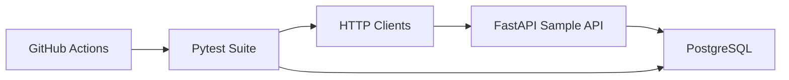

# API Testing Automation Framework

**Pytest, FastAPI, PostgreSQL, Docker, GitHub Actions**

A production-style, zero-cost portfolio project for QA automation engineers, SDETs, and backend developers. It includes a minimal FastAPI sample API and a reusable Pytest framework with schema validation, database checks, negative tests, coverage reporting, and CI integration.

## Why API Testing Matters

API tests are faster than UI tests and more realistic than isolated unit tests. They validate:

- Authentication and authorization
- Request/response contracts
- Business workflows across endpoints
- Data persistence behavior

This project demonstrates how to build that layer professionally without paid tools or cloud services.

## Architecture



See [docs/ARCHITECTURE.md](docs/ARCHITECTURE.md) for details.

## Tech Stack

| Area | Tools |
|------|-------|
| Sample API | FastAPI, SQLAlchemy, JWT |
| Tests | Pytest, HTTPX, jsonschema |
| Database | PostgreSQL 16 |
| Reports | coverage.py, pytest-html |
| Infra | Docker Compose, GitHub Actions |

## Project Structure

```
api-testing-automation-framework/
├── sample_api/          # FastAPI app under test
├── tests/               # Automation framework
│   ├── clients/         # API client abstractions
│   ├── config/          # Environment settings
│   ├── data/            # JSON fixtures
│   ├── helpers/         # Assertions, factories, DB helpers
│   └── schemas/         # JSON Schema contracts
├── docs/                # Strategy and extension guides
├── reports/             # Local HTML/coverage output
└── .github/workflows/   # CI pipeline
```

## Local Setup

### Prerequisites

- Python 3.11 (recommended; required for `psycopg2-binary` wheels)
- Docker and Docker Compose
- `make` and `curl`

If your local Python is newer than 3.11, use `make test-docker` after `make up`.

### Quick Start

```bash
cd api-testing-automation-framework
cp .env.example .env
make install
make up
make test
```

### Run Sample API Only

```bash
make up
curl http://localhost:8000/health
open http://localhost:8000/docs
```

## Run Tests

```bash
# Full suite
make test

# With coverage
make coverage

# HTML report
make report
```

Direct Pytest command:

```bash
source .venv/bin/activate
pytest tests/ -v
```

## Generate Reports

| Command | Output |
|---------|--------|
| `make coverage` | Terminal summary + `reports/coverage/index.html` |
| `make report` | `reports/report.html` |

## Adapt to Another API

1. Update `.env` `BASE_URL` and `DATABASE_URL`
2. Add client classes in `tests/clients/`
3. Add schemas in `tests/schemas/`
4. Add factories and fixtures
5. Create new `test_*.py` modules

Full guide: [docs/HOW_TO_EXTEND.md](docs/HOW_TO_EXTEND.md)

## CI Pipeline

On every push/PR to `main`:

1. Install Python dependencies
2. Start PostgreSQL + sample API with Docker Compose
3. Wait for `/ready`
4. Run Pytest with coverage
5. Upload coverage artifact

Details: [docs/CI_PIPELINE.md](docs/CI_PIPELINE.md)

## Makefile Commands

| Command | Description |
|---------|-------------|
| `make up` | Start PostgreSQL and sample API |
| `make down` | Stop containers |
| `make test` | Run regression tests (local venv) |
| `make test-docker` | Run tests in Python 3.11 container |
| `make coverage` | Run tests with coverage report |
| `make report` | Generate pytest HTML report |
| `make logs` | Tail service logs |
| `make reset` | Recreate containers and volumes |
| `make install` | Create venv and install dependencies |

## Test Categories

- **Health**: liveness and readiness
- **Auth**: register, login, duplicate prevention, protected routes
- **Users**: current user profile, invalid token
- **Items**: full CRUD with schema validation
- **Negative**: invalid payloads, unauthorized access, bad IDs
- **Database**: user/item persistence and soft delete

Strategy: [docs/TEST_STRATEGY.md](docs/TEST_STRATEGY.md)

## Resume Bullets

Ready-to-use bullets: [docs/RESUME_BULLETS.md](docs/RESUME_BULLETS.md)

Example:

> Built a reusable API testing framework with Pytest, schema validation, database checks, negative tests, coverage reporting, and CI workflow integration.

## Screenshots for Portfolio

See [docs/SCREENSHOTS_GUIDE.md](docs/SCREENSHOTS_GUIDE.md).

## License

MIT — use freely for learning, portfolios, and interviews.
