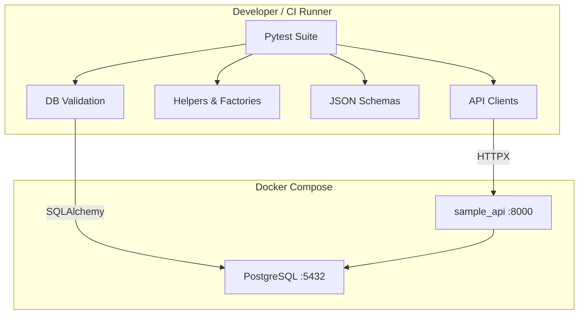

# Architecture

## Overview

This repository separates the **system under test** (sample FastAPI API) from the **automation framework** (Pytest test suite). The framework is designed to be portable: you can point it at any compatible REST API by changing configuration, clients, and schemas.

## Components

| Layer | Responsibility |
|-------|----------------|
| `sample_api/` | Minimal FastAPI service with JWT auth and item CRUD |
| `tests/config/` | Environment-aware settings via `.env` |
| `tests/clients/` | Reusable HTTP client abstractions |
| `tests/helpers/` | Assertions, factories, database checks |
| `tests/schemas/` | Contract validation for API responses |
| `tests/data/` | Static JSON fixtures |
| `reports/` | Local HTML and coverage output |
| `.github/workflows/` | CI regression pipeline |

## Request Flow

1. Pytest fixture creates a user and obtains a JWT.
2. Client classes attach the token to protected requests.
3. Tests assert HTTP status, JSON schema, and database state.
4. Coverage and optional HTML reports are generated locally or in CI.

## Design Principles

- **Zero cost**: local Docker, open-source tooling only
- **Reusable clients**: one place for headers, auth, timeouts
- **Contract checks**: schemas catch breaking API changes early
- **Persistence validation**: API success is not enough; DB state is verified
- **CI parity**: same commands locally and in GitHub Actions
