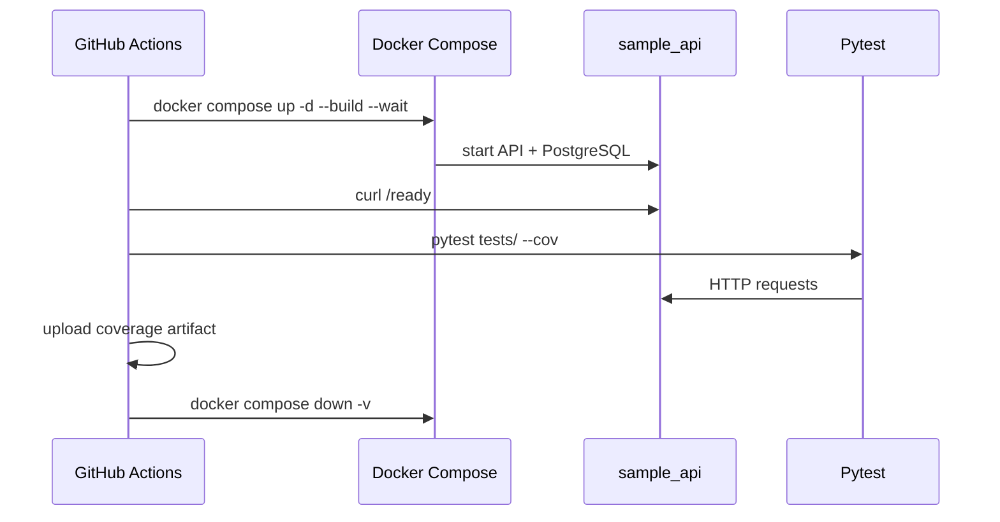

# CI Pipeline

## Workflow

File: `.github/workflows/api-tests.yml`



## Triggers

- Push to `main` or `master`
- Pull requests targeting `main` or `master`

## Steps

| Step | Purpose |
|------|---------|
| Checkout | Clone repository |
| Set up Python 3.11 | Install runtime with pip cache |
| Install dependencies | Test + API requirements |
| Start services | PostgreSQL + FastAPI via Compose |
| Wait for readiness | Poll `/ready` endpoint |
| Run pytest | Full regression with coverage XML |
| Upload artifact | Store `reports/coverage.xml` |
| Stop services | Tear down containers and volumes |

## Local Parity

Run the same flow locally:

```bash
make up
make test
make coverage
make down
```

## Extending CI

- Add matrix builds for Python 3.11 and 3.12
- Publish coverage to Codecov (free for public repos)
- Add `pytest -m smoke` for faster PR checks
- Fail build on coverage threshold with `--cov-fail-under`
