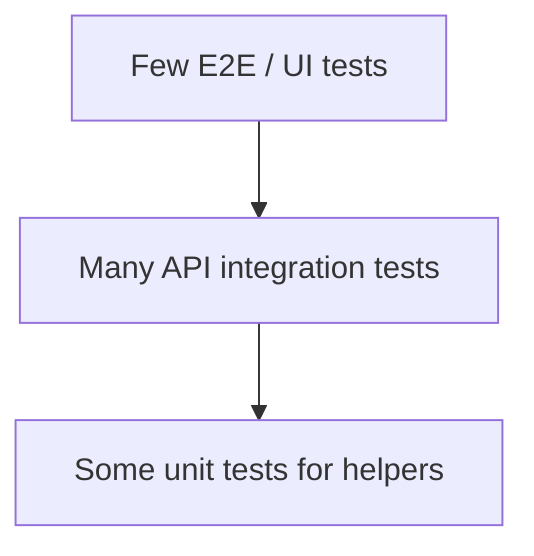

# Test Strategy

## Test Pyramid

This framework focuses on the **API integration layer** because it offers the best balance of speed, reliability, and confidence for backend services.

## Positive Tests

Positive tests verify expected behavior with valid inputs:

- Health and readiness endpoints respond successfully
- User registration and login work
- Authenticated CRUD operations succeed
- Response bodies match JSON schemas

## Negative Tests

Negative tests verify the API fails safely:

- Missing required fields return `422`
- Invalid credentials return `401`
- Duplicate registration returns `409`
- Unknown resource IDs return `404`
- Protected routes reject missing or invalid tokens

## Contract / Schema Validation

Each major response type has a JSON Schema:

- `user_schema.json`
- `item_schema.json`
- `error_schema.json`

Schema validation catches silent contract drift such as renamed fields, missing properties, or unexpected types.

## Authentication Testing

Auth coverage includes:

- Register → login → access protected route
- Reject bad passwords
- Reject missing bearer token
- Reject malformed JWT

## Database Validation

API responses can be correct while persistence fails. Database checks confirm:

- Users are stored after registration
- Items are linked to the correct owner
- Soft-deleted items remain in DB with `is_deleted = true`

## CI Regression Testing

GitHub Actions:

1. Starts PostgreSQL and the sample API
2. Waits for `/ready`
3. Runs the full Pytest suite with coverage
4. Uploads coverage artifact

## Limitations

- No load or performance testing
- No browser/UI automation
- No multi-service distributed tracing
- Schema validation is structural, not business-rule exhaustive
- Tests assume a clean enough database state; heavy parallel runs may need isolation strategy

## Recommended Next Steps

- Add contract tests from OpenAPI spec
- Add test markers for smoke vs full regression
- Add factory-based DB seeding per test module
- Add parallel test execution with isolated tenants
